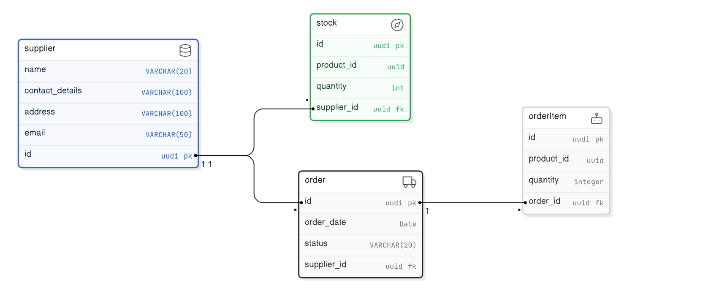

# Inventory Management System Micro-service

This project is a Spring Boot application for inventory management. It includes features for managing suppliers, stocks, orders, and order items. The application also incorporates security measures to restrict unauthorized access.

## Table of Contents

1. [Getting Started](#getting-started)
2. [Features](#features)
3. [Technologies Used](#technologies-used)
4. [Project Structure](#project-structure)
5. [Security](#security)
6. [Exception Handling](#exception-handling)
7. [Entity Relationship Diagram](#entity-relational-diagram)

## Getting Started

### Prerequisites

- Java 21 or higher
- Maven
- PostgreSQL

### Installation

1. Clone the repository:
    ```sh
    git clone https://github.com/Kudoo39/integrify-java-inventory-service
    cd integrify-java-inventory-service
    ```

2. Configure the `application.properties` file in the `src/main/resources` directory with your database settings.

3. Run the application (ensure your database is running before starting the application)

## Features

The following endpoints are available in the application:

### Orders

- `POST /orders` - Create a new order
- `GET /orders` - Retrieve all orders
- `GET /orders/{id}` - Retrieve a specific order by ID
- `PUT /orders/{id}` - Update an order
- `DELETE /orders/{id}` - Cancel an order

### Stock

- `POST /stocks` - Create a new stock entry
- `GET /stocks` - Retrieve all stock entries
- `GET /stocks/{id}` - Retrieve a specific stock entry by ID
- `PUT /stocks/{id}` - Update stock information
- `DELETE /stocks/{id}` - Delete an stock entry
- `GET /stocks/supplier/{supplierId}` - Retrieve all stock entries by supplier ID
- `GET /stocks/product/{productId}` - Retrieve a specific stock entry by product ID
- `GET /stocks/lowstock` - Retrieve all stock entries which are low

### Suppliers

- `POST /suppliers` - Create a new supplier
- `GET /suppliers` - Retrieve all suppliers
- `GET /suppliers/{id}` - Retrieve a specific supplier by ID
- `PUT /suppliers/{id}` - Update supplier information
- `DELETE /suppliers/{id}` - Delete a supplier

### Reporting

- Automated daily reports for inventory and sales.

## Technologies Used

- Java
- Spring Boot
- Spring Security
- JPA
- Maven
- PostgreSQL

## Project Structure

```
src
 ┣ main
 ┃ ┣ java
 ┃ ┃ ┗ com
 ┃ ┃ ┃ ┗ example
 ┃ ┃ ┃ ┃ ┣ application
 ┃ ┃ ┃ ┃ ┃ ┣ dtos
 ┃ ┃ ┃ ┃ ┃ ┃ ┣ orderDto
 ┃ ┃ ┃ ┃ ┃ ┃ ┃ ┣ OrderCreateDto.java
 ┃ ┃ ┃ ┃ ┃ ┃ ┃ ┣ OrderReadDto.java
 ┃ ┃ ┃ ┃ ┃ ┃ ┃ ┗ OrderUpdateDto.java
 ┃ ┃ ┃ ┃ ┃ ┃ ┣ orderItemDto
 ┃ ┃ ┃ ┃ ┃ ┃ ┃ ┣ OrderItemCreateDto.java
 ┃ ┃ ┃ ┃ ┃ ┃ ┃ ┣ OrderItemReadDto.java
 ┃ ┃ ┃ ┃ ┃ ┃ ┃ ┗ OrderItemUpdateDto.java
 ┃ ┃ ┃ ┃ ┃ ┃ ┣ stockDto
 ┃ ┃ ┃ ┃ ┃ ┃ ┃ ┣ StockCreateDto.java
 ┃ ┃ ┃ ┃ ┃ ┃ ┃ ┣ StockReadDto.java
 ┃ ┃ ┃ ┃ ┃ ┃ ┃ ┗ StockUpdateDto.java
 ┃ ┃ ┃ ┃ ┃ ┃ ┣ supplierDto
 ┃ ┃ ┃ ┃ ┃ ┃ ┃ ┣ SupplierCreateDto.java
 ┃ ┃ ┃ ┃ ┃ ┃ ┃ ┣ SupplierReadDto.java
 ┃ ┃ ┃ ┃ ┃ ┃ ┃ ┗ SupplierUpdateDto.java
 ┃ ┃ ┃ ┃ ┃ ┃ ┣ OrderItemMapper.java
 ┃ ┃ ┃ ┃ ┃ ┃ ┣ OrderMapper.java
 ┃ ┃ ┃ ┃ ┃ ┃ ┣ StockMapper.java
 ┃ ┃ ┃ ┃ ┃ ┃ ┗ SupplierMapper.java
 ┃ ┃ ┃ ┃ ┃ ┣ notification
 ┃ ┃ ┃ ┃ ┃ ┃ ┗ NotificationService.java
 ┃ ┃ ┃ ┃ ┃ ┣ order
 ┃ ┃ ┃ ┃ ┃ ┃ ┣ IOrderService.java
 ┃ ┃ ┃ ┃ ┃ ┃ ┗ OrderService.java
 ┃ ┃ ┃ ┃ ┃ ┣ orderItem
 ┃ ┃ ┃ ┃ ┃ ┃ ┣ IOrderItemService.java
 ┃ ┃ ┃ ┃ ┃ ┃ ┗ OrderItemService.java
 ┃ ┃ ┃ ┃ ┃ ┣ report
 ┃ ┃ ┃ ┃ ┃ ┃ ┣ InventoryReport.java
 ┃ ┃ ┃ ┃ ┃ ┃ ┣ ReportService.java
 ┃ ┃ ┃ ┃ ┃ ┃ ┣ SalesReport.java
 ┃ ┃ ┃ ┃ ┃ ┃ ┗ ScheduledTasks.java
 ┃ ┃ ┃ ┃ ┃ ┣ stock
 ┃ ┃ ┃ ┃ ┃ ┃ ┣ IStockService.java
 ┃ ┃ ┃ ┃ ┃ ┃ ┣ LowStockAlertService.java
 ┃ ┃ ┃ ┃ ┃ ┃ ┗ StockService.java
 ┃ ┃ ┃ ┃ ┃ ┗ supplier
 ┃ ┃ ┃ ┃ ┃ ┃ ┣ ISupplierService.java
 ┃ ┃ ┃ ┃ ┃ ┃ ┗ SupplierService.java
 ┃ ┃ ┃ ┃ ┣ domain
 ┃ ┃ ┃ ┃ ┃ ┣ order
 ┃ ┃ ┃ ┃ ┃ ┃ ┣ IOrderRepo.java
 ┃ ┃ ┃ ┃ ┃ ┃ ┣ Order.java
 ┃ ┃ ┃ ┃ ┃ ┃ ┗ OrderStatus.java
 ┃ ┃ ┃ ┃ ┃ ┣ orderItem
 ┃ ┃ ┃ ┃ ┃ ┃ ┣ IOrderItemRepo.java
 ┃ ┃ ┃ ┃ ┃ ┃ ┗ OrderItem.java
 ┃ ┃ ┃ ┃ ┃ ┣ stock
 ┃ ┃ ┃ ┃ ┃ ┃ ┣ IStockRepo.java
 ┃ ┃ ┃ ┃ ┃ ┃ ┗ Stock.java
 ┃ ┃ ┃ ┃ ┃ ┗ supplier
 ┃ ┃ ┃ ┃ ┃ ┃ ┣ ISupplierRepo.java
 ┃ ┃ ┃ ┃ ┃ ┃ ┗ Supplier.java
 ┃ ┃ ┃ ┃ ┣ infrastructure
 ┃ ┃ ┃ ┃ ┃ ┣ order
 ┃ ┃ ┃ ┃ ┃ ┃ ┣ IOrderJpaRepo.java
 ┃ ┃ ┃ ┃ ┃ ┃ ┗ OrderRepo.java
 ┃ ┃ ┃ ┃ ┃ ┣ orderItem
 ┃ ┃ ┃ ┃ ┃ ┃ ┣ IOrderItemJpaRepo.java
 ┃ ┃ ┃ ┃ ┃ ┃ ┗ OrderItemRepo.java
 ┃ ┃ ┃ ┃ ┃ ┣ stock
 ┃ ┃ ┃ ┃ ┃ ┃ ┣ IStockJpaRepo.java
 ┃ ┃ ┃ ┃ ┃ ┃ ┗ StockRepo.java
 ┃ ┃ ┃ ┃ ┃ ┗ supplier
 ┃ ┃ ┃ ┃ ┃ ┃ ┣ ISupplierJpaRepo.java
 ┃ ┃ ┃ ┃ ┃ ┃ ┗ SupplierRepo.java
 ┃ ┃ ┃ ┃ ┣ presentation
 ┃ ┃ ┃ ┃ ┃ ┣ customException
 ┃ ┃ ┃ ┃ ┃ ┃ ┣ BadRequest.java
 ┃ ┃ ┃ ┃ ┃ ┃ ┣ Conflict.java
 ┃ ┃ ┃ ┃ ┃ ┃ ┣ Forbidden.java
 ┃ ┃ ┃ ┃ ┃ ┃ ┣ OutOfStock.java
 ┃ ┃ ┃ ┃ ┃ ┃ ┣ ResourceNotFound.java
 ┃ ┃ ┃ ┃ ┃ ┃ ┗ Unauthorized.java
 ┃ ┃ ┃ ┃ ┃ ┣ security
 ┃ ┃ ┃ ┃ ┃ ┃ ┣ ApiKeyFilter.java
 ┃ ┃ ┃ ┃ ┃ ┃ ┣ JWTService.java
 ┃ ┃ ┃ ┃ ┃ ┃ ┗ SecurityConfig.java
 ┃ ┃ ┃ ┃ ┃ ┣ shared
 ┃ ┃ ┃ ┃ ┃ ┃ ┣ ErrorEntity.java
 ┃ ┃ ┃ ┃ ┃ ┃ ┣ ErrorResponseEntity.java
 ┃ ┃ ┃ ┃ ┃ ┃ ┗ GlobalExceptionHandler.java
 ┃ ┃ ┃ ┃ ┃ ┣ OrderController.java
 ┃ ┃ ┃ ┃ ┃ ┣ OrderItemController.java
 ┃ ┃ ┃ ┃ ┃ ┣ StockController.java
 ┃ ┃ ┃ ┃ ┃ ┗ SupplierController.java
 ┃ ┃ ┃ ┃ ┗ InventoryServiceApplication.java
 ┃ ┗ resources
 ┃ ┃ ┣ static
 ┃ ┃ ┣ templates
 ┃ ┃ ┣ application.properties
 ┃ ┃ ┣ env.properties
 ┃ ┃ ┣ env.properties.example
 ┃ ┃ ┣ er_diagram.png
 ┃ ┃ ┗ logback-spring.xml
 ┗ test
 ┃ ┗ java
 ┃ ┃ ┗ com
 ┃ ┃ ┃ ┗ example
 ┃ ┃ ┃ ┃ ┗ inventory_service
 ┃ ┃ ┃ ┃ ┃ ┗ InventoryServiceApplicationTests.java
```

## Security

The application uses API key-based authentication to restrict unauthorized access to API endpoints.

### Configuring the API Key

Configure the API key in the `env.properties` file: `API_KEY=your_api_key`

## Exception Handling

Exceptions are handled centrally using custom exception classes defined in the `presentation/customException`. These exceptions are then caught and processed in `presentation/shared/GlobalExceptionHandler.java`.

## Entity Relational Diagram


